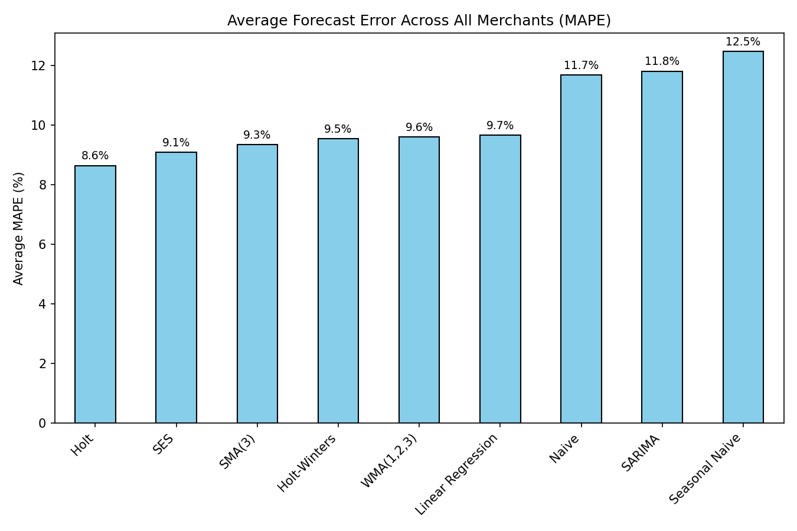
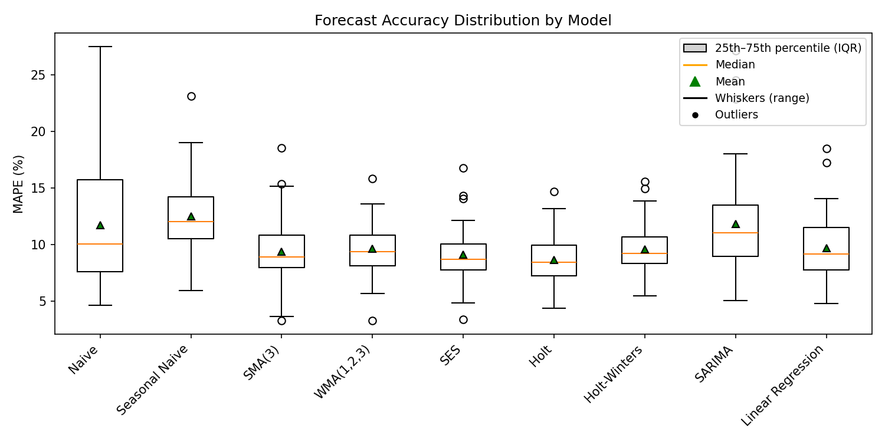
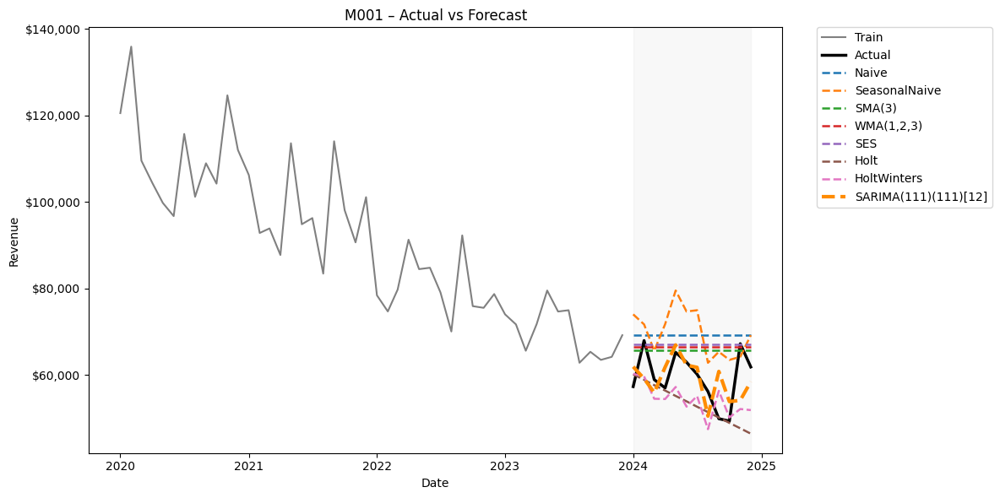

# Merchant Revenue Forecasting

**Goal:** Forecast monthly merchant revenue across 50 merchants (5 years of data) and compare multiple forecasting methods.  
**Why:** Advanced forecasting reduces error in budgets and informs resource planning.  
**Result:** Advanced models (Holt-Winters, SARIMA, Linear Regression) cut forecast error from ~12–13% (Seasonal Naive baseline) to **~8–10% MAPE**.

---

## Dataset
- **Scope:** 50 merchants × 60 months (Jan 2020 – Dec 2024).
- **Columns:** `date`, `merchant_id`, `region`, `vertical`, `revenue`, `orders`, `avg_order_value`, `marketing_spend`, `promo_month`, `seasonal_index`, `macro_index`, `mktg_rev_ratio`, `cac_per_order`.
- **Features:**
  - *Seasonal Index*: captures within-year demand swings (e.g., Dec > 1 = holiday boost; Jan < 1 = lull).
  - *Macro Index*: economy-wide effects (shock + recovery in 2020).
  - Marketing spend with diminishing returns, plus promo lifts.

Synthetic data was generated but designed to mimic realistic FP&A challenges.

---

## Methods
- **Baselines:** Naive, Seasonal Naive, Simple Moving Average (SMA), Weighted Moving Average (WMA).
- **Classical:** Simple Exponential Smoothing (SES), Holt’s Linear Trend, Holt-Winters Seasonal.
- **Time Series:** SARIMA.
- **Drivers:** Linear Regression with marketing spend, promo flags, seasonality, and lagged revenue.

---

## Evaluation
- **Train/Test:** Last 12 months per merchant used for testing.
- **Metrics:** MAPE, sMAPE, MAE, RMSE, MASE.
- **Portfolio View:** Results aggregated across all merchants into leaderboards and distribution charts.

---

## Results

### Average Forecast Error (MAPE)

- Baseline (Seasonal Naive): ~12–13% MAPE  
- Best advanced models: Holt-Winters / SARIMA / Linear Regression ~8–10% MAPE  
- ~30% relative improvement in forecast accuracy  

---

### Distribution of Errors (Boxplot)

- Each box = error spread across merchants.  
- **Orange line:** median error.  
- **Green triangle:** mean error.  
- **Whiskers/dots:** variation and outliers.  
- Advanced models show both lower medians and tighter distributions → more consistent across merchants.

---

### Example Merchant Forecast

- Actual vs forecast for one merchant.  
- Shows improvement of Holt-Winters/SARIMA over the naive baseline, especially in capturing seasonality.

---

## Business Implications
- **Tighter planning:** Cutting error from ~12–13% to ~8–10% improves budgets and inventory/cash planning.  
