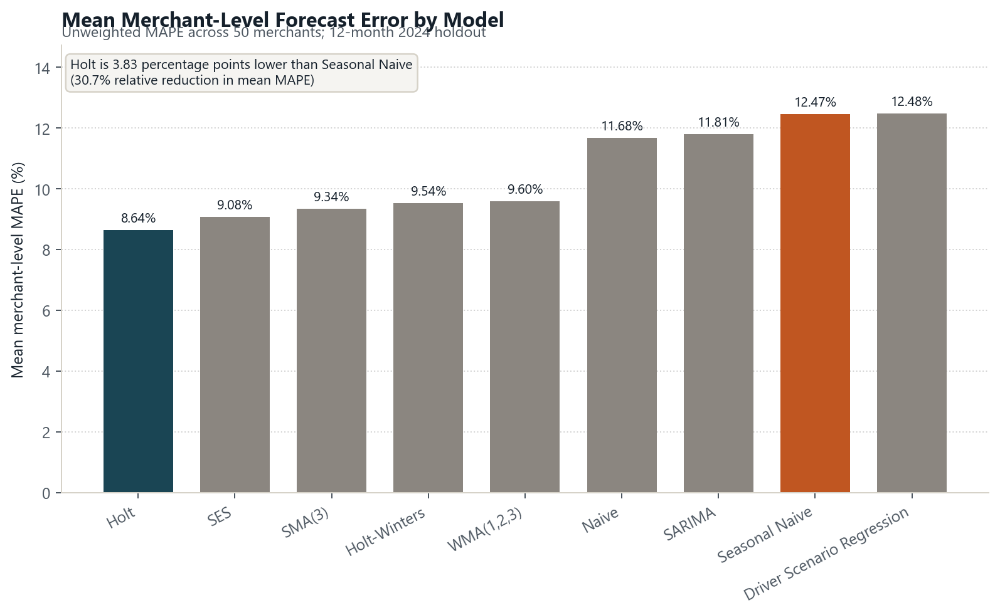
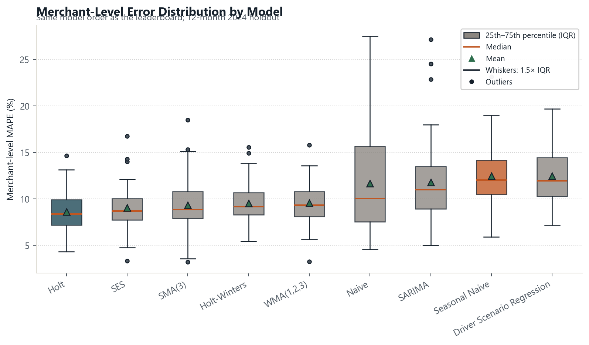
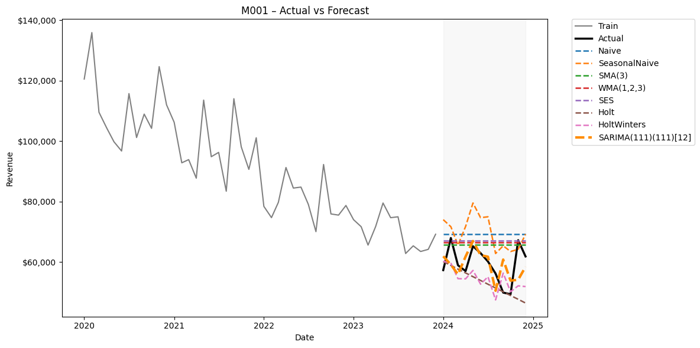

# Merchant Revenue Forecasting

## Executive Summary

This is a **self-directed finance analytics / forecasting portfolio project** that benchmarks nine monthly revenue forecasting methods across a synthetic merchant portfolio.

- **50 synthetic merchants**
- **60 months** of history (January 2020 – December 2024)
- **9 forecasting methods** evaluated on a common holdout
- **Holt** produced the lowest mean MAPE at approximately **8.6%**
- **Seasonal Naive** baseline mean MAPE was approximately **12.5%**
- That is approximately a **31% relative reduction** in mean MAPE versus the Seasonal Naive baseline

The dataset is fully synthetic. It is designed to resemble realistic FP&A forecasting challenges and does **not** contain real merchant, employer, or customer data.

## Business Question

How can Finance improve monthly merchant revenue forecasting across a heterogeneous merchant portfolio, and which forecasting method provides the best balance of accuracy, stability, and interpretability?

In an FP&A setting, the practical decision is which method to prefer for merchant-level planning support: a simple seasonal baseline, a classical smoothing approach, a seasonal time-series model, or a driver-based regression model.

## Dataset

- **Type:** Synthetic panel dataset (no real-world merchant identities)
- **Coverage:** 50 merchants × 60 months = **3,000** observations
- **Period:** January 2020 through December 2024
- **Grain:** One row per merchant-month
- **Primary target:** `revenue`
- **Key fields:** `date`, `merchant_id`, `region`, `vertical`, `revenue`, `orders`, `avg_order_value`, `marketing_spend`, `promo_month`, `seasonal_index`, `macro_index`, `mktg_rev_ratio`, `cac_per_order`
- **Data dictionary:** [`data/raw/merchant_monthly_data_dictionary.json`](data/raw/merchant_monthly_data_dictionary.json)
- **Raw file:** [`data/raw/merchant_monthly_revenue.xlsx`](data/raw/merchant_monthly_revenue.xlsx)
- **Generator:** [`data/generator/data_generator.py`](data/generator/data_generator.py) with fixed seed `42` for reproducibility

## Forecasting Approaches

The **portfolio pipeline** (`source/all_merchants.py`) benchmarks nine methods:

| Group | Methods |
|-------|---------|
| Baselines | Naive, Seasonal Naive, SMA(3), WMA(1,2,3) |
| Classical smoothing | SES, Holt, Holt-Winters |
| Time series | SARIMA |
| Driver-based | Linear Regression (marketing spend, promo flag, macro index, lagged revenue, month effects) |

A single-merchant example script produces an illustrative actual-vs-forecast chart for merchant `M001`. That example is intentionally lighter than the full nine-model portfolio benchmark.

## Evaluation Methodology

- **Horizon:** 12-month-ahead forecast
- **Train / test split:** For each merchant, the final 12 months are held out for testing; earlier months are used for training
- **Primary comparison metric:** MAPE (mean absolute percentage error), useful for comparing relative error across merchants of different scale
- **Supporting metrics:** RMSE, MAE, sMAPE, and MASE

Multiple metrics are reported because no single error measure is universally best. MAPE is convenient for portfolio comparison, while RMSE/MAE emphasize absolute error and MASE provides a scale-free check relative to a seasonal naive benchmark.

## Key Findings

Verified mean MAPE ranking across all 50 merchants:

| Rank | Model | Mean MAPE |
|------|-------|-----------|
| 1 | Holt | ~8.64% |
| 2 | SES | ~9.08% |
| 3 | SMA(3) | ~9.34% |
| 4 | Holt-Winters | ~9.54% |
| 5 | WMA(1,2,3) | ~9.60% |
| 6 | Linear Regression | ~9.66% |
| 7 | Naive | ~11.68% |
| 8 | SARIMA | ~11.81% |
| 9 | Seasonal Naive | ~12.47% |

**Headline result:** Holt achieved the lowest mean MAPE (~8.6%) versus Seasonal Naive (~12.5%), an approximate **31% relative reduction** in mean MAPE.

**Governance takeaway:** Greater model complexity did not guarantee better average performance. SARIMA, for example, was not among the strongest average performers in this benchmark. Method selection should be evidence-based and refreshed as new observations arrive.

Best-model counts also vary by merchant (Holt was most frequently best by MAPE, followed by Linear Regression and Holt-Winters), reinforcing that portfolio averages and merchant-level results should be reviewed together.

## Finance / FP&A Implications

Lower and more stable merchant-level forecast error can support:

- budgeting and revenue planning
- resource allocation discussions
- scenario planning around uncertain merchants
- identifying where forecast uncertainty is persistently higher

This project does **not** estimate dollar savings, claim production deployment, or assert real employer outcomes. The value demonstrated here is methodological: a transparent, reproducible framework for comparing forecasting approaches before using them in planning workflows.

## Visual Results

### Average forecast error (MAPE)


Portfolio-level comparison of mean MAPE by method. Holt is lowest (~8.6%); Seasonal Naive is the weakest baseline (~12.5%).

### Distribution of errors (boxplot)


Spread of merchant-level MAPE by method. Useful for assessing consistency, not only average error.

### Example merchant forecast


Actual versus forecast paths for merchant `M001` over the 12-month test window (illustrative single-merchant view).

## Repository Structure

```text
data/
  generator/data_generator.py          # synthetic data generator (seed=42)
  raw/merchant_monthly_revenue.xlsx    # synthetic panel dataset
  raw/merchant_monthly_data_dictionary.json
  transformed/                         # generated Excel outputs (not committed)
functions/
  forecast_methods.py                  # forecast helpers + horizon H=12
  metrics.py                           # MAPE, RMSE, MAE, sMAPE, MASE
source/
  all_merchants.py                     # full 9-model portfolio benchmark
  single_merchant_forecast.py          # illustrative M001 forecasts
  single_merchant_forecast_metrics.py  # M001 metrics
plots/
  forecasting_leaderboard.py           # leaderboard + boxplot figures
  single_merchant_graphs.py            # M001 actual-vs-forecast figure
figures/                               # publication figures
requirements.txt
README.md
```

## How to Reproduce

From the project root:

```bash
# Optional: create and activate a virtual environment
python -m venv .venv

# Windows
.venv\Scripts\activate

# macOS / Linux
# source .venv/bin/activate

pip install -r requirements.txt

# Regenerate synthetic raw data and dictionary (optional; committed raw file already exists)
python data/generator/data_generator.py

# Run the full portfolio model comparison
python source/all_merchants.py

# Generate portfolio figures (requires leaderboard.xlsx from the step above)
python plots/forecasting_leaderboard.py

# Optional: regenerate the illustrative single-merchant figure
python plots/single_merchant_graphs.py
```

No cloud services, API keys, or environment variables are required.

## Validation & Limitations

- The dataset is **synthetic**; results may differ on real merchant businesses
- Merchants are heterogeneous; portfolio averages can hide merchant-level differences
- Forecast quality should be reviewed both at the portfolio level and by merchant
- This repository demonstrates a benchmarking framework; it is **not** a production forecasting service
- Results are associative evaluation outcomes, not causal claims about business interventions
- Model rankings should be refreshed as new months of data arrive
- The single-merchant example does not implement every portfolio model; use `source/all_merchants.py` for the full nine-model comparison

## Tools

- Python
- pandas
- numpy
- statsmodels
- scikit-learn
- matplotlib
- openpyxl

---

**More finance projects and management-ready case studies: [efrainfinance.com](https://efrainfinance.com/)**
