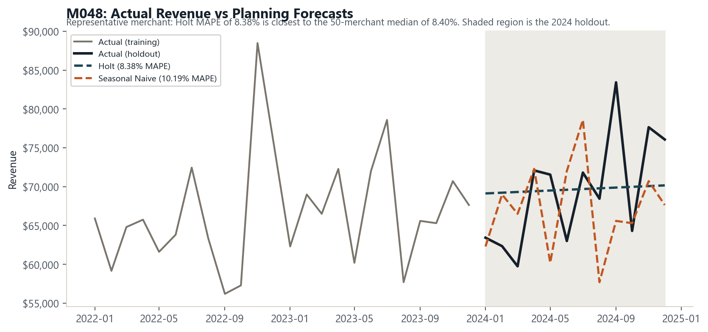

# Merchant Revenue Forecasting

## Executive Summary

This is a **self-directed finance analytics / FP&A portfolio project**. It answers a planning question: which method should Finance use as the default 12-month merchant-revenue forecast, and when should merchant-level performance justify an exception?

- **50 synthetic merchants**
- **60 months** of history (January 2020 – December 2024)
- **9 forecasting methods** evaluated on a common 12-month horizon
- Primary 2024 holdout: **Holt** produced the lowest unweighted mean of merchant-level MAPE at **8.64%**
- **Seasonal Naive** baseline: **12.47%**
- That is a **3.83 percentage-point** improvement, or a **30.7% relative reduction** versus Seasonal Naive
- Rolling-origin results **do not** support Holt as a time-robust default: **SES** had the lowest average error across 2022–2024

The dataset is fully synthetic. It is designed to resemble realistic FP&A forecasting challenges and does **not** contain real merchant, employer, or customer data.

## Business Question

Which forecasting method should Finance use as the default 12-month merchant-revenue forecast, and when should merchant-level performance justify an exception?

Finance needs a consistent, defensible forecast across merchants with different growth, seasonality, and volatility. The practical decision is to choose a default planning method and establish exception rules—not to crown a model because it is more sophisticated.

## Dataset

- **Type:** Synthetic panel dataset (no real-world merchant identities)
- **Coverage:** 50 merchants × 60 months = **3,000** observations
- **Period:** January 2020 through December 2024
- **Grain:** One row per merchant-month
- **Primary target:** `revenue`
- **Key fields:** `date`, `merchant_id`, `region`, `vertical`, `revenue`, `orders`, `avg_order_value`, `marketing_spend`, `promo_month`, `seasonal_index`, `macro_index`, `mktg_rev_ratio`, `cac_per_order`
- **Data dictionary:** [`data/raw/merchant_monthly_data_dictionary.json`](data/raw/merchant_monthly_data_dictionary.json)
- **Raw file:** [`data/raw/merchant_monthly_revenue.xlsx`](data/raw/merchant_monthly_revenue.xlsx)
- **Generator:** [`data/generator/data_generator.py`](data/generator/data_generator.py) with fixed seed `42` for reproducibility

## Forecasting Approaches

The portfolio pipeline (`source/all_merchants.py`) benchmarks nine methods on the same cutoff and 12-month horizon:

| Group | Methods |
|-------|---------|
| Baselines | Naive, Seasonal Naive, SMA(3), WMA(1,2,3) |
| Classical smoothing | SES, Holt, Holt-Winters |
| Time series | SARIMA |
| Driver-based | Driver Scenario Regression |

**Driver Scenario Regression** is a scenario-conditioned planning forecast, not a pure univariate forecast. At the origin it may use only training-period information plus explicit planning assumptions:

- Marketing-spend plan: same calendar month in the prior year from training data
- Promotion plan: prior-year promotion calendar from training data
- Macro assumption: last known training-period value, carried forward
- `rev_lag1`: recursive predicted revenue after the first forecast month
- `rev_lag12`: corresponding known historical value on a 12-month horizon

It does **not** use holdout-period revenue, marketing spend, promotions, macro outcomes, or backfilled lags.

A representative-merchant chart is selected programmatically: the merchant whose Holt MAPE is closest to the 50-merchant median. That example currently is `M048`.

## Evaluation Methodology

- **Horizon:** 12-month-ahead forecast
- **Primary window:** train through December 2023; hold out calendar 2024
- **Rolling origins:** forecast 2022 from December 2021; 2023 from December 2022; 2024 from December 2023
- **Primary ranking metric:** unweighted mean of merchant-level MAPE. This is **not** overall portfolio MAPE and **not** a revenue-weighted accuracy score.
- **Supporting metrics:** median MAPE, IQR of merchant-level MAPE, MAE, RMSE, sMAPE, MASE, and best-model counts
- **Coverage:** every expected merchant/model/window combination is recorded. Ineligible methods are documented rather than silently skipped. The pipeline fails if an eligible model fails.

SARIMA and Driver Scenario Regression require 36 months of training history, so they are not eligible for the 2022 window. Like-for-like rolling ranks use the seven methods available in every window.

Committed verification files:

- [`results/model_performance_summary.csv`](results/model_performance_summary.csv)
- [`results/merchant_model_metrics.csv`](results/merchant_model_metrics.csv)
- [`results/best_model_counts.csv`](results/best_model_counts.csv)
- [`results/rolling_window_summary.csv`](results/rolling_window_summary.csv)
- [`results/coverage_report.csv`](results/coverage_report.csv)

## Key Findings

Verified 2024 holdout ranking, unweighted mean of merchant-level MAPE:

| Rank | Model | Mean MAPE | Median MAPE | IQR | Best-model count | Best-model % |
|------|-------|-----------|-------------|-----|------------------|--------------|
| 1 | Holt | 8.64% | 8.40% | 2.73 | 17 | 34% |
| 2 | SES | 9.08% | 8.69% | 2.28 | 7 | 14% |
| 3 | SMA(3) | 9.34% | 8.87% | 2.89 | 5 | 10% |
| 4 | Holt-Winters | 9.54% | 9.19% | 2.35 | 8 | 16% |
| 5 | WMA(1,2,3) | 9.60% | 9.34% | 2.68 | 4 | 8% |
| 6 | Naive | 11.68% | 10.04% | 8.12 | 3 | 6% |
| 7 | SARIMA | 11.81% | 11.02% | 4.56 | 3 | 6% |
| 8 | Seasonal Naive | 12.47% | 12.03% | 3.70 | 1 | 2% |
| 9 | Driver Scenario Regression | 12.48% | 11.98% | 4.17 | 2 | 4% |

**Headline 2024 result:** Holt achieved the lowest mean merchant-level MAPE (8.64%) versus Seasonal Naive (12.47%), a 3.83 percentage-point improvement and a 30.7% relative reduction.

**Complexity did not automatically help:** after origin-safe assumptions replaced leaked holdout drivers, Driver Scenario Regression (12.48%) and SARIMA (11.81%) underperformed simpler smoothing methods.

**Merchant-level variation:** Holt was best for 17 of 50 merchants (34%). Holt-Winters was next at 8 merchants (16%). No method won everywhere.

Rolling-window mean merchant-level MAPE for methods eligible in every window:

| Rank | Model | 2022 | 2023 | 2024 | Average |
|------|-------|------|------|------|---------|
| 1 | SES | 10.73% | 9.42% | 9.08% | 9.75% |
| 2 | SMA(3) | 10.31% | 9.87% | 9.34% | 9.84% |
| 3 | Holt | 12.31% | 8.71% | 8.64% | 9.88% |

Holt won the 2023 and 2024 origins but was weaker in 2022. SES had the most stable average. SARIMA and Driver Scenario Regression are excluded from that like-for-like rank because they were not eligible in 2022; in 2023 both were materially worse than the smoothing methods.

## Planning Recommendation

Use a **champion/challenger** policy rather than locking Holt in as a permanent default.

1. Treat Holt as the 2024 champion for the latest 12-month holdout.
2. Keep Seasonal Naive as the minimum-performance benchmark every cycle.
3. Continue SES and SMA(3) as challengers, because they were stronger or more stable across rolling origins.
4. Allow a merchant-level override only when another method produces consistently lower error across multiple forecast windows.
5. Maintain a high-uncertainty watchlist for merchants with persistently elevated or volatile forecast error. Those merchants should receive wider planning ranges, additional business-partner input, and explicit upside/downside scenarios.

## Finance / FP&A Implications

A governable planning process needs a transparent champion, an objective baseline, and exception rules. Lower merchant-level forecast error can support budgeting and revenue planning, but this project does **not** estimate dollar savings, claim production deployment, or assert real employer outcomes.

**Takeaway for finance leaders:** The best forecasting process is not necessarily the most technically complex. A transparent default-or-champion model, an objective baseline, and disciplined exception monitoring can provide a more governable planning process than selecting models by sophistication alone.

## Visual Results

### Mean merchant-level forecast error


Unweighted MAPE across 50 merchants; 12-month 2024 holdout. Holt is lowest (8.64%); Seasonal Naive is the planning baseline (12.47%).

### Distribution of merchant-level errors


Same model order as the leaderboard. Whiskers are 1.5× IQR. Holt combined low average error with a comparatively contained distribution versus weaker methods, although no method eliminated variation across merchants.

### Representative merchant forecast


Merchant `M048` is shown because its Holt MAPE (8.38%) is closest to the 50-merchant median (8.40%). The chart compares actual revenue with Holt and Seasonal Naive only.

## Repository Structure

```text
data/
  generator/data_generator.py          # synthetic data generator (seed=42)
  raw/merchant_monthly_revenue.xlsx    # synthetic panel dataset
  raw/merchant_monthly_data_dictionary.json
  transformed/                         # optional diagnostic Excel outputs (not committed)
functions/
  config.py                            # windows, model names, eligibility rules
  forecast_methods.py                  # origin-safe forecast helpers + horizon H=12
  planning_assumptions.py              # driver plans constructed from training data
  evaluation.py                        # merchant-window evaluation and coverage
  metrics.py                           # MAPE, RMSE, MAE, sMAPE, MASE
source/
  all_merchants.py                     # full 9-model rolling benchmark
  single_merchant_forecast.py          # optional diagnostic
  single_merchant_forecast_metrics.py  # optional diagnostic
plots/
  forecasting_leaderboard.py           # leaderboard + boxplot figures
  representative_merchant.py           # median-merchant actual-vs-forecast figure
results/                               # committed verification CSVs
figures/                               # publication figures
case-study/                            # two-page executive PDF source
tests/                                 # leakage, coverage, and reconciliation tests
requirements.txt
README.md
```

## How to Reproduce

From the project root:

```bash
# Optional: create and activate a virtual environment
python -m venv .venv

# Windows
.venv\Scripts\activate

# macOS / Linux
# source .venv/bin/activate

pip install -r requirements.txt

# Regenerate synthetic raw data and dictionary (optional; committed raw file already exists)
python data/generator/data_generator.py

# Run the full portfolio model comparison, including rolling windows
python source/all_merchants.py

# Generate publication figures from committed result files
python plots/forecasting_leaderboard.py
python plots/representative_merchant.py

# Optional: regenerate the two-page case-study PDF
python case-study/generate_pdf.py

# Leakage, coverage, and publication-reconciliation tests
pytest
```

No cloud services, API keys, or environment variables are required.

## Validation & Limitations

- The dataset is **synthetic**; results may differ on real merchant businesses
- Headline MAPE is an **unweighted mean across merchants** and should not be read as portfolio-dollar forecast error
- Merchants are heterogeneous; averages can hide merchant-level differences
- Driver Scenario Regression depends on planning assumptions available at the forecast origin
- SARIMA and Driver Scenario Regression were not eligible for the 2022 rolling window
- Model rankings should be refreshed as new months of data arrive
- This repository demonstrates a benchmarking and forecast-governance framework; it is **not** a production forecasting service
- Results are associative evaluation outcomes, not causal claims about business interventions
- Automated tests in `tests/` confirm that forecasts do not read holdout actuals or holdout actual drivers, that training rows never occur after the cutoff, that recursive `rev_lag1` uses predictions, and that no future-looking backfill is applied

## Tools

- Python
- pandas
- numpy
- statsmodels
- scikit-learn
- matplotlib
- openpyxl
- pytest
- pymupdf
